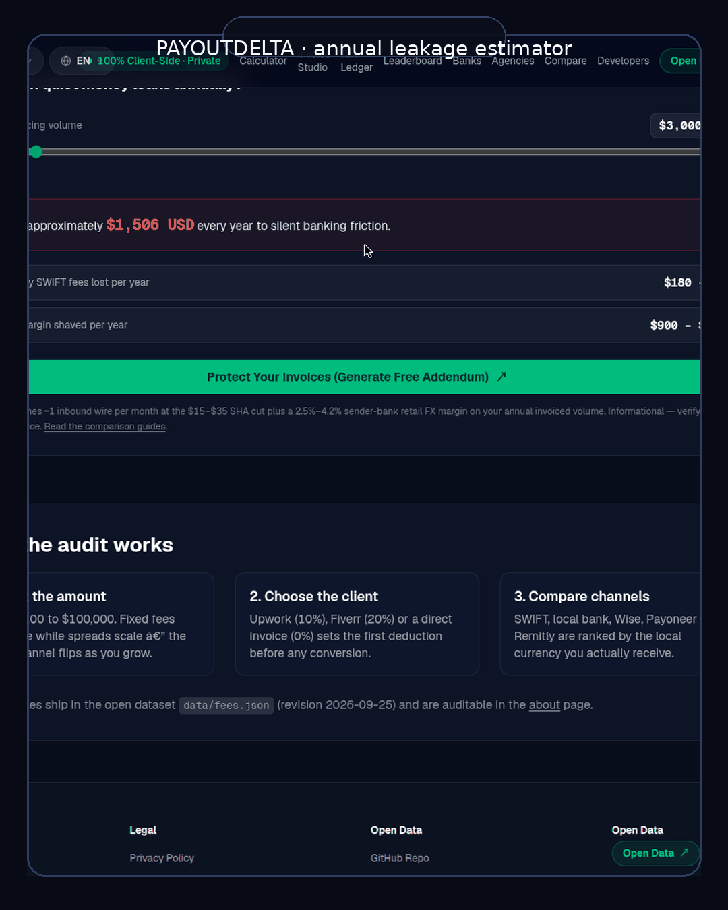

# PayoutDelta

**Freelancers lose ~4.2% of every cross-border withdrawal to stacked fees and FX markups. PayoutDelta shows exactly where the money goes, and which rail keeps the most of it.**

Live site: https://ahmadbilaldsa.github.io/payout-delta



## What it is

An open directory of payout corridors. Pick a route (e.g. US to Pakistan) and see every realistic way to receive the money (Payoneer, Wise, PayPal, bank SWIFT, local rails) with the full fee stack for each: receive fee, withdrawal fee, FX spread, and what you actually keep.

- **131 corridors** modeled from provider fee schedules (`data/fees.json`, updated 2026-09-25)
- **Annual leakage estimator**: enter monthly volume, see yearly loss
- **Reverse calculator**: enter what you want to receive, get what you must send
- **Split optimizer**: compares rails side-by-side for the cheapest path
- **Offline-first**: static export + service worker; no account, no tracking

## The numbers

- **Rs 12,755** lost per $1,000 Payoneer withdrawal to Pakistan vs. the cheapest rail
- **7.5x** fee ratio between the cheapest and priciest channel on the same corridor
- **Rs 306,120/year** at $2k/month volume

Figures are modeled from provider pricing pages (see data sources below).

## Data sources

Fees are compiled from provider pricing pages, support docs, and community reports. Every corridor page lists its assumptions. **Spot a wrong number? Open an issue.** Fee corrections are the fastest way to contribute, and they are checked against the source.

## Run it locally

```
git clone https://github.com/AhmadBilalDSA/payout-delta.git
cd payout-delta
npm install
npm run dev      # opens http://localhost:3000
npm run build    # static export
```

## Project structure

- `app/`: Next.js routes (static export)
- `data/fees.json`: the corridor dataset (CC0, see below)
- `data/banks.ts`: bank dossiers; `lib/`: fee math, SWIFT routing
- `scripts/`: sitemap / IndexNow / llms.txt generation

## Contributing

Fee corrections, new corridors, and UI fixes are all welcome (see `CONTRIBUTING.md`). Please keep numbers traceable to a source.

## License

- Code: **MIT**
- Fee dataset (`data/`): **CC0**: public domain. Build trackers, alerts, and comparisons on it.

---

If this saved you money, star it. That is how other freelancers find it.
